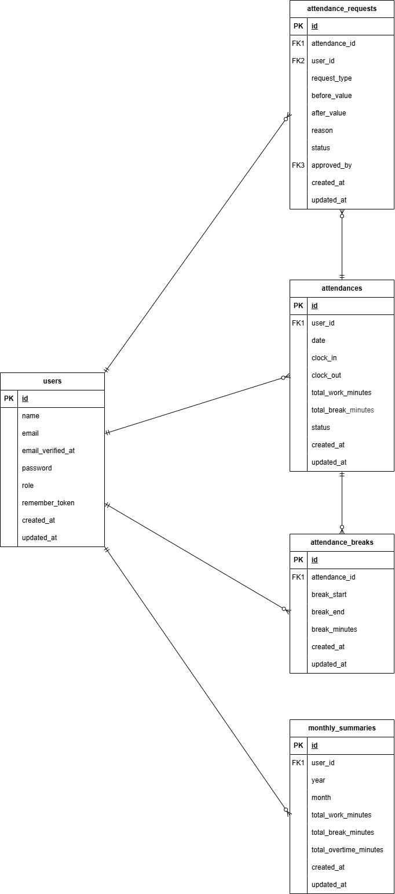

# Attendance-Management-App（勤怠管理アプリ）

## プロジェクト概要

本アプリは、勤怠管理アプリの基本機能を実装したものです。
打刻や勤怠の確認、修正などの基本的な勤怠管理機能を備えています。

**主な機能：**

- 会員登録 / ログイン / ログアウト
- 勤怠登録 / 修正・承認 / 一覧表示 / 詳細表示

## Docker ビルド

1. リポジトリをクローン
   ```bash
   git clone <REPOSITORY_URL>
   ```
2. コンテナをビルド
   ```bash
   docker compose up -d --build
   ```

## 環境構築

1. PHP コンテナに入る
   ```bash
   docker compose exec php bash
   ```
2. Composer インストール
   ```bash
   composer install
   ```
3. `.env` ファイルを作成し、環境変数を適宜変更
   ```bash
   cp .env.example .env
   ```
4. アプリケーションキー作成
   ```bash
   php artisan key:generate
   ```
5. マイグレーション実行
   ```bash
   php artisan migrate
   ```
6. シーディング実行
   ```bash
   php artisan db:seed
   ```

## メール認証

MailHogを使用しています。
.envファイルのMAIL_FROM_ADDRESSは任意のメールアドレスを入力してください。

## 使用技術（実行環境）

- PHP **8.2**
- Laravel **8.x**
- MySQL **8.0.26**
- nginx **1.21.1**
- Docker / Docker Compose
- phpMyAdmin
- MailHog（メール確認用）

## ER図



## ユーザー情報

- name：一般ユーザー1
　email：user1@example.com
　password：password
- name：一般ユーザー2
　email：user2@example.com
　password：password
- name：管理者ユーザー
　email：user3@example.com
　password：password

## PHPUnitを利用したテストに関して

**以下のコマンド：**
   ```bash
//テスト用データベースの作成
docker-compose exec mysql bash
mysql -u root -p
//パスワードはlaravel_passと入力
create database test_database;

docker-compose exec php bash
php artisan migrate:fresh --env=testing
./vendor/bin/phpunit
   ```

## URL一覧

- 一般ユーザーログイン画面：http://localhost/login
- 管理者ユーザーログイン画面：http://localhost/admin/login
- 会員登録画面：http://localhost/register
- phpMyAdmin：http://localhost:8080/
- MailHog（メール確認）：http://localhost:8025/